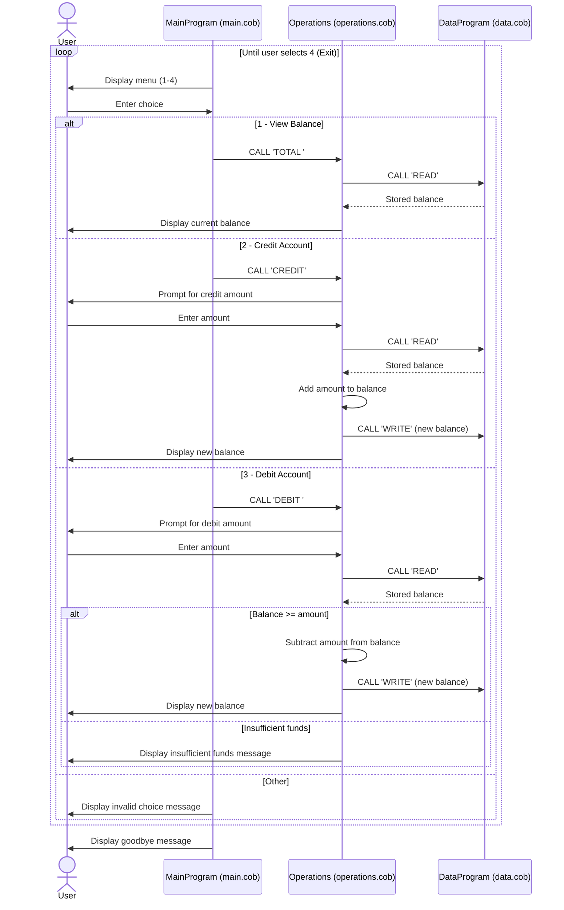

# COBOL Account Management System

This directory documents the COBOL account-management example in
[`src/cobol/`](../src/cobol/). The program provides a menu for viewing an
account balance, crediting the account, debiting it, and exiting.

## Source programs

| File | Purpose |
| --- | --- |
| [`main.cob`](../src/cobol/main.cob) | Entry point and interactive menu. Reads the user's selection, dispatches view, credit, or debit requests to `Operations`, and exits when the user chooses option 4. |
| [`operations.cob`](../src/cobol/operations.cob) | Implements account operations. Reads and displays the balance, accepts credit/debit amounts, updates the balance for successful transactions, and rejects a debit when funds are insufficient. |
| [`data.cob`](../src/cobol/data.cob) | Provides the balance store used by `Operations`. Its `READ` operation copies the stored balance to the caller; `WRITE` replaces the stored balance with the caller's value. |

## Key functions and call flow

1. `MainProgram` displays the menu and calls `Operations` with `TOTAL`,
   `CREDIT`, or `DEBIT` according to the user's choice.
2. `Operations` calls `DataProgram` with `READ` before showing or changing the
   balance.
3. For a successful credit or debit, `Operations` updates its balance and calls
   `DataProgram` with `WRITE`.
4. `DataProgram` holds the balance in `STORAGE-BALANCE` for the running
   program. Both the operations module and data module initialize their balance
   fields to `1000.00`; the data module's value is the one read as the stored
   balance.

The monetary fields use `PIC 9(6)V99`: six whole-number digits and two implied
decimal places. The `V` does not display a decimal point as part of the numeric
field.

## Student-account business rules

The current code does not model students or distinguish student accounts. It
has one balance and no student ID, name, enrollment status, account type, or
student-specific fees, limits, or eligibility rules. The following are the
account rules implemented by the sample:

- The stored balance starts at `1000.00`.
- A credit adds the entered amount to the current balance and saves the result.
- A debit is permitted only when the current balance is greater than or equal
  to the entered amount. If it is not, the program displays an insufficient
  funds message and leaves the stored balance unchanged.
- Viewing the balance reads and displays the stored value without changing it.

There is no explicit validation for zero or negative transaction amounts,
amounts exceeding the numeric field's capacity, or malformed input. In
particular, the insufficient-funds check alone does not prevent a negative
debit from increasing the balance. These behaviors are not student-account
policies; they are validation gaps in the current example.

## Data flow sequence diagram

